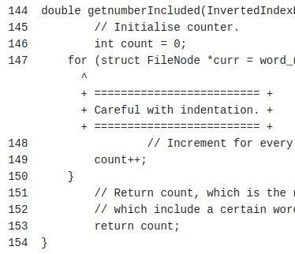
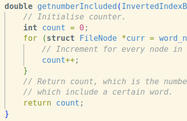
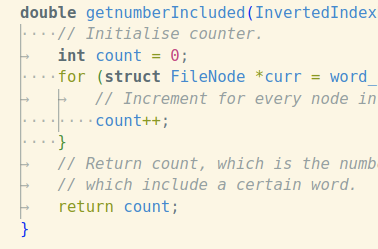
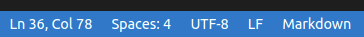

# Indenting your code

## The problem

When you receive your assignment marks, you might see that you lost marks for this kind of thing:



You might also be wondering how that could be, because in your editor, your code probably looked like this:



---

## The cause

The most common cause of this problem is **mixing tabs and spaces**. We can use either to indent code, but mixing them together (i.e. using both for indentation instead of just one) is a bad idea. The problem is mostly to do with tabs in particular, since they get treated a little differently. Tabs are often *rendered* as multiple spaces to make it easy for humans to see, despite the fact that each tab is really just a single character. But the number of spaces that each tab is rendered as is something that varies depending on what you're using to look at your code.

The first screenshot is taken from a `cgi` page, accessible via WebCMS in the `View Submissions` sidebar option. On this page, we can see that tabs are being rendered as **8** spaces. Seeing as we often use 4 space indents when using spaces, this makes the difference between the two types of indentation very visible. This is also how your code looks to us when we're using our marking software, so if we see this kind of thing, it's a dead giveaway that you're mixing tabs and spaces.

The second screenshot is taken from inside VSCode. Here, we can see that tabs are being rendered as 4 spaces, so at first glance nothing appears to be wrong. However, VSCode allows you to explicitly show whitespace characters:



The arrows are tabs, and the dots are spaces.

---

## The fix

This kind of thing (among others) is solved in the real world via automatic formatters which will take your code and format it according to some accepted rules, eliminating the chance for human error. The most common one for C/C++ is `clang-format`, but it's much too sophisticated and unnecessary for a course like COMP2521. These tools are touched on in COMP1531. Properly configuring your editor's indentation preferences will get you 99% of the way there, though.

### If you use VSCode

Almost everyone uses VSCode these days, so there are a few things you can do to help yourself out:
- When editing a file, go to the bottom bar and click the button that says something like `Spaces: 4`. Click the option presented to you when you do this to `Convert Indentation to Spaces`. If the button in the bottom bar said `Tabs: 4` or similar, then you should also click the `Indent Using Spaces` option, and set your tab size to 4. After doing both of these things, it's worth having a look over your code to make sure nothing is out of alignment due to the expansion of tabs into spaces.

    
- To turn on the whitespace character view shown previously, open the command palette via `Ctrl/Cmd + Shift + P`, type `View: Toggle Render Whitespace` and then click the option presented to you to enable it.

### If you don't use VSCode

You will have to investigate other options to replicate the above depending on what code editor you use instead. You can at least convert all tabs in a file to spaces though using the `expand` terminal command, but be **extremely** careful when using it, as if you get it wrong you can potentially overwrite your files with blanks and end up losing all of your code! For example, if I want to convert all tabs to spaces in the file `MyLab.c`, I would type the command
```bash
# Be super, super careful that you don't type > MyLab.c at the end,
# because that will delete all of your work, and this cannot be undone
expand -i -t 4 MyLab.c > MyLab_formatted.c
```
to create a new file `MyLab_formatted.c` with the conversion done. I can then delete the old `MyLab.c` file and give the newly-created file that name instead. **Note that if you use VSCode, you do not have to use this command! This is exactly what the first dotpoint in the previous section does for you.**
